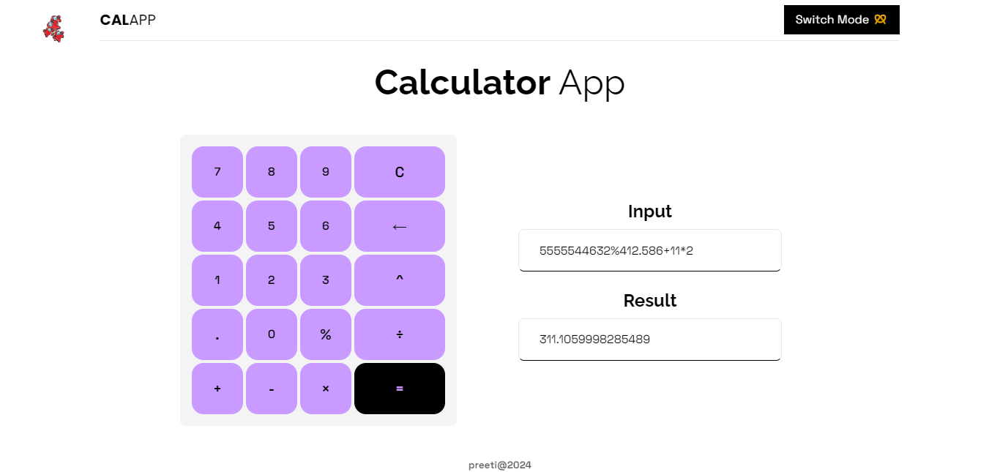
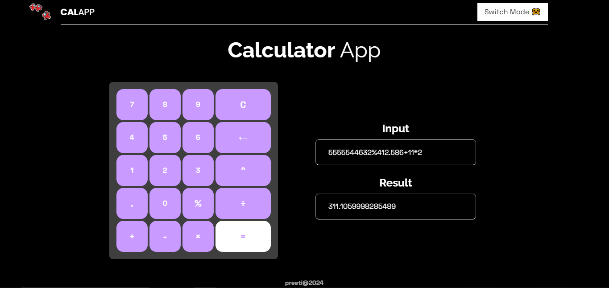
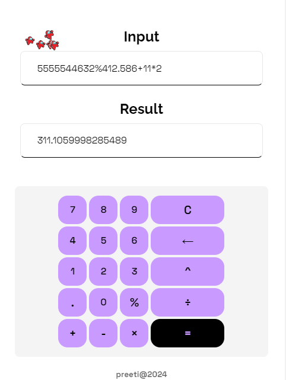

# React Calculator App 🧩

A simple calculator application built using React and Vite.

## Features ✨

- Basic arithmetic operations: addition, subtraction, multiplication, division
- Backspace functionality to remove the last input character
- Clear functionality to reset the input and result
- Displays both the input expression and the result
- Includes an exponentiation (`^`) and modulus (`%`) operation

## Installation ⚙

1. Clone the repository:

   ```bash
   git clone https://github.com/yourusername/react-calculator-app.git
   cd react-calculator-app
   ```

2. Dependencies:
   ```bash
   npm Install
   ```
3. Run the App
   ```bash
   npm run dev
   ```
4. Navigate the URL:
   http://localhost:5173/


## Screenshots 📸

### Desktop View



### Desktop Dark Mode



### Mobile View

